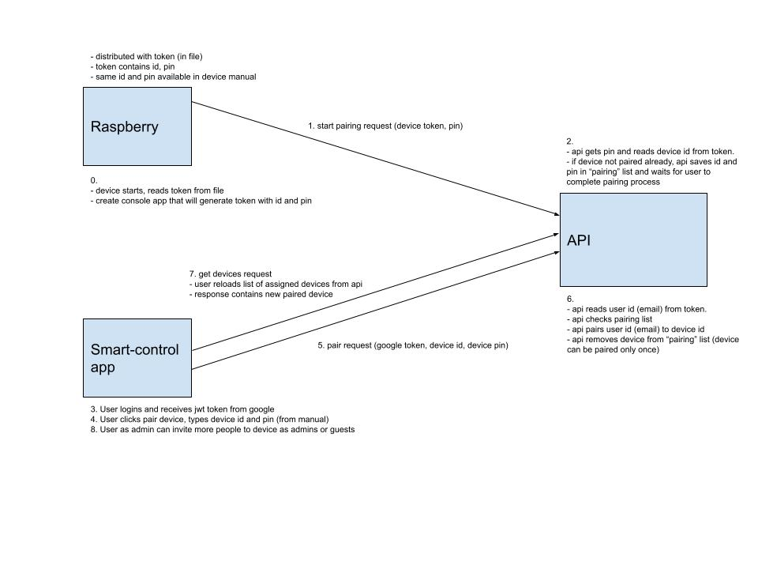
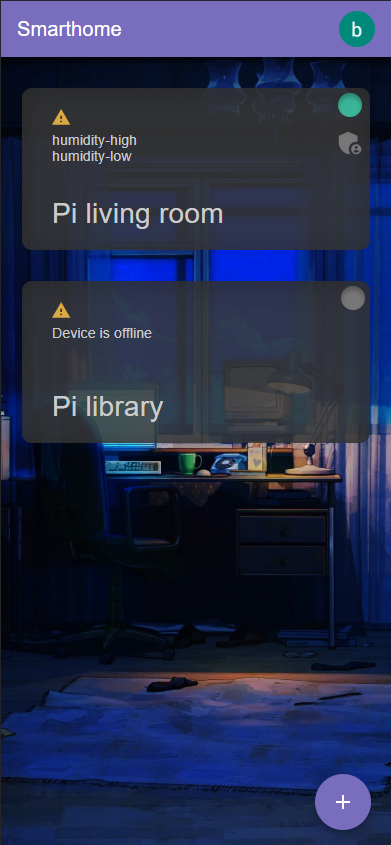
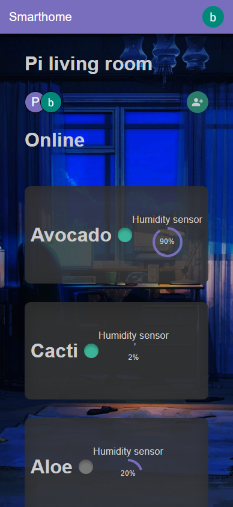
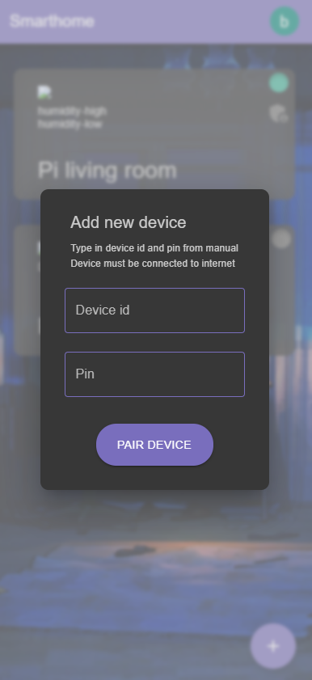

# Smart-control
This project is for managing and retrieving household information using an ARM computer.

## the solution consists of the following projects:

### Key-generator
The console application that generates private and public key. By using a token generator and a private key, a JWT token is generated, which is then used to authorize the device against the api.

### Token-generator
An application that uses a private key to generate a JWT for a given device. The JWT contains the device id and pin intended for pairing. The token is serialized and stored in a file. The resulting token file needs to be uploaded to the device. The JWT token is then used to authorize the device against the API.

### Device-app:
Reads the device ID, PIN and token data from a file generated in the token generator. The token is required to authorize the device. The device will start the pairing process at startup. The device periodically sends sensor data to the API.

### Device-test-app
A React application simulates a smarthome device.

### Devices-api
Rest api. It enables communication between devices and users.

### Smart-control-app
React application for data viewing and household management.
When starting the application, the user logs in with a google account. The user adds a device waiting for pairing by entering the device id and pin that he receives in the manual. After successful pairing, he has an overview of his devices with the option to view details.
The user as an administrator has the option to add additional accounts with the role of admin or guest to the device he owns.

## Authorization and devices pairing workflow

## App preview

Devices list page

Device detail page

Adding new device